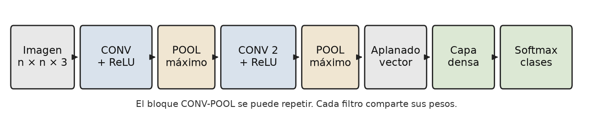
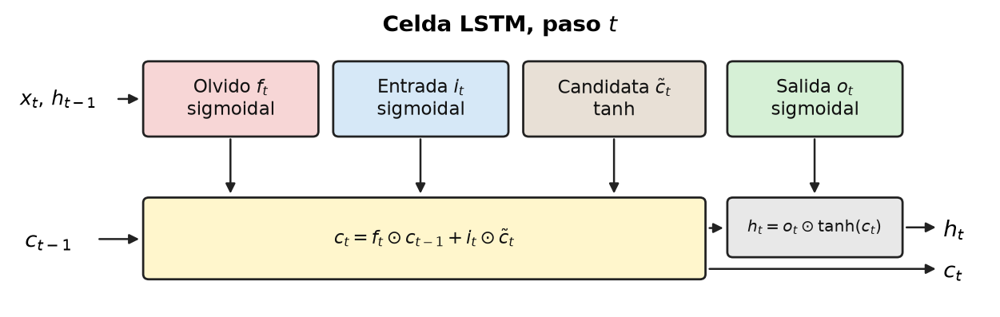
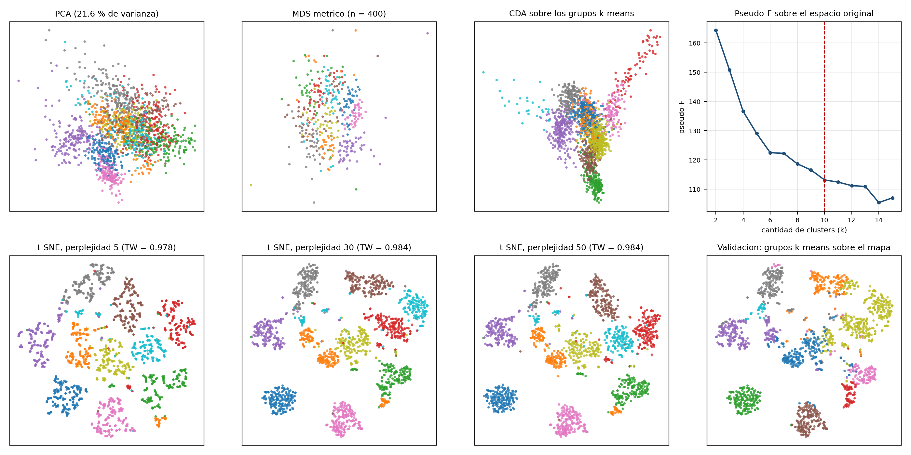
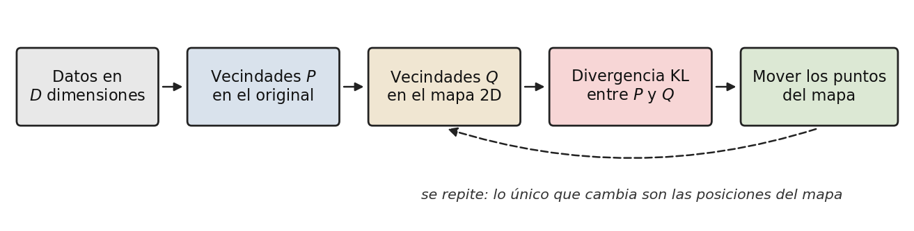
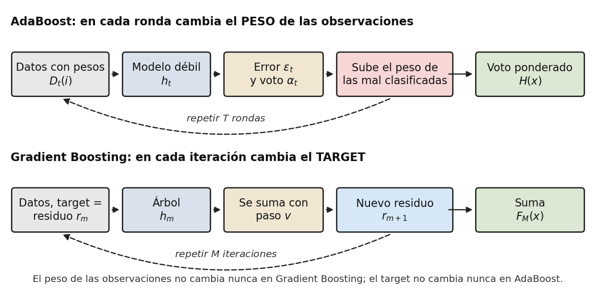
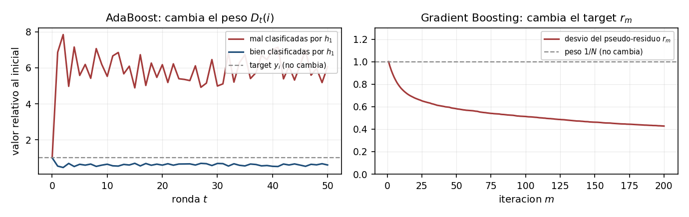
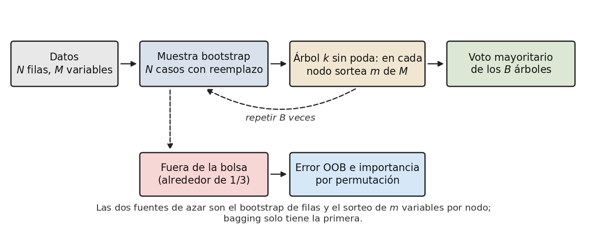
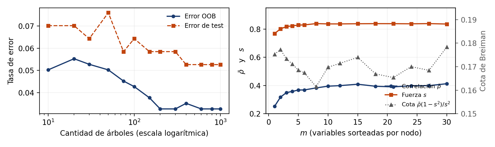

<!-- PORTADA grupal: nombres en la misma hoja del título (via apptocmd maketitle).
     Sin campo author: en el YAML. -->

```{r setup, include=FALSE}
# Locale C imprime ó como el texto literal <U+00F3> en kable y en fig.cap.
Sys.setlocale("LC_ALL", "en_US.UTF-8")
library(knitr)
library(kableExtra)

knitr::opts_chunk$set(
  echo      = FALSE,
  warning   = FALSE,
  message   = FALSE,
  fig.pos   = "H",
  out.width = "42%",
  fig.align = "center"
)
```

<!-- ============================================================================
     CONSIGNA GENERAL (transcripta del PDF del examen)

     - Grupos de hasta 4 alumnos. Es valido el examen individual.
     - Entrega: antes del 5 de octubre de 2026, en un archivo PDF.
     - Se debe detallar la fuente de cada respuesta.
     - No mas de 4 hojas por pregunta.
     - Portada con los nombres de los miembros del grupo.
     - El profesor puede pedir a cualquier integrante una explicacion adicional.
     - Rigor en las expresiones y en las descripciones.
     - La nota se normaliza en funcion del mejor examen.

     CRITERIOS DE DETECCION DE USO INADECUADO DE LLM
     - Inconsistencias entre secciones del trabajo.
     - Terminologia muy avanzada sin comprension demostrable.
     - Codigo perfecto sin comentarios personales.
     - Referencias irrelevantes o inexistentes.
     - Estilo de escritura inconsistente.

     PENALIZACIONES POR ESTILO ARTIFICIAL
     - -20 % por respuesta que use jerga tecnica sin explicar.
     - -30 % por respuesta que no muestre proceso de razonamiento personal.
     - -50 % por respuesta que parezca generada automaticamente.
     ============================================================================ -->

# Ejercicio 1 · Redes neuronales

## Punto I

*Explique el papel de las funciones de activación en redes neuronales profundas.
Discuta por qué son necesarias, cómo afectan la capacidad de representación y cuáles
son sus ventajas y desventajas más importantes.*

La combinación agrega las entradas ponderadas, en general
$w_0 + w_1 x_1 + \dots + w_d x_d$, y la activación transforma esa suma en la salida
de la neurona (Volpacchio, s.f.-e). Sin no linealidad, capas apiladas colapsan a
$W_2(W_1 x)=(W_2 W_1)x$ y la capacidad de representación iguala a una regresión
lineal. Cybenko (1989) muestra que una capa oculta sigmoidal aproxima cualquier
función continua sobre un compacto. El apunte cubre escalón, sigmoidal, tanh y
softmax (salida multiclase). Se agrega ReLU, la unidad lineal rectificada, por su uso
actual (Goodfellow et al., 2016).

```{r e1-act, echo=FALSE}
act <- data.frame(
  Funcion = c("Escalón", "Sigmoidal", "Tanh", "Softmax", "ReLU"),
  Rango = c("-1 / 1", "(0, 1)", "(-1, 1)", "suma 1", "[0, +inf)"),
  Ventaja = c(
    "Separa linealmente",
    "Salida como probabilidad",
    "Centrada en cero",
    "Multiclase",
    "Poco desvanecimiento"
  ),
  Limitante = c(
    "Derivada nula",
    "Saturación",
    "Saturación",
    "Solo en la salida",
    "Neuronas muertas"
  ),
  check.names = FALSE,
  stringsAsFactors = FALSE
)
names(act) <- c("Función", "Rango", "Ventaja", "Limitante")
kable(
  act,
  booktabs = TRUE,
  caption = "Activaciones: rango, ventaja y limitante."
) %>%
  kable_styling(latex_options = "HOLD_position", position = "center", font_size = 10) %>%
  column_spec(1, width = "2.2cm") %>%
  column_spec(2, width = "2.2cm") %>%
  column_spec(3, width = "4.6cm") %>%
  column_spec(4, width = "3.6cm")
```

*Nota.* Elaboración propia (Volpacchio, s.f.-e). Desvanecimiento del gradiente: producto
de derivadas en cascada que se acerca a cero.

## Punto II

*Describa el proceso de entrenamiento de una red neuronal (forward pass, función de
pérdida, backpropagation, optimización). Analice conceptualmente qué factores
determinan la calidad del aprendizaje. Explique las diferencias esenciales entre redes
"Deep" y "Shallow".*

El entrenamiento busca los pesos que minimizan el error (Volpacchio, s.f.-e). En el
forward pass (propagar hacia adelante) cada neurona combina y activa hasta la
predicción $o$. La pérdida mide la discrepancia entre $o$ y el objetivo $t$: error
cuadrático o verosimilitud logarítmica. En backpropagation (propagar el error hacia
atrás), con sigmoidal y error cuadrático,
$w_{ji} \leftarrow w_{ji} - \eta\, \delta_j\, o_i$. En la optimización, $\eta$ es la
tasa de aprendizaje, entre 0 y 1. Online actualiza por observación (una pasada es una
época); batch, por lectura completa.

La calidad depende de los datos frente a la cantidad de pesos, de $\eta$, de los
mínimos locales y del corte. El apunte frena el sobreajuste con early stopping (corte
temprano) y weight decay (penalización de pesos grandes). Ese apunte es una red
superficial (shallow), de un solo salto no lineal. Goodfellow et al. (2016) oponen
la profunda (deep), que apila capas y aprende jerarquías, con más datos y más riesgo
de desvanecimiento.

## Punto III

*Explique el concepto de "embedding" y autoencoder en el contexto de "Deep Learning".
De ejemplos de uso.*

Embedding y autoencoder no aparecen con este detalle en los PDF de redes; se definen
con bibliografía externa. El apunte sí comprime una imagen al agrupar píxeles con una
red no supervisada (Volpacchio, s.f.-e).

Un embedding es un vector denso y corto para un objeto discreto: en word2vec, palabras
de contextos parecidos quedan próximas (Mikolov et al., 2013). Un autoencoder
reconstruye su entrada. El encoder comprime hacia un código de menor dimensión (el
cuello de botella) y el decoder reconstruye; la pérdida es el error de reconstrucción y
no hay etiquetas. Usos: reducción de dimensión no lineal (Hinton & Salakhutdinov, 2006),
anomalías y eliminación de ruido.

## Punto IV

*De un tipo de red neuronal que sirve para obtener clustering. La que elija, explique
brevemente cómo funciona.*

Se elige el SOM (Self Organizing Map, mapa autoorganizado), la red de Kohonen del
apunte. Se descartan k-means y DBSCAN, que no son redes, y el competitive learning
del apunte: agrupa, pero no ordena el mapa (Volpacchio, s.f.-e; Kohonen, 1990).

Hay una capa de entrada y una grilla de Kohonen, en general bidimensional. Cada
neurona $U_j$ tiene pesos $w_j$ de la misma dimensión que la entrada. El entrenamiento
es no supervisado: para cada $x$, la ganadora $U_{win}$ minimiza $\lVert x - w_j \rVert$
y se actualiza $w_j(t) = w_j(t-1) + (x - w_j)\,\eta(t)\,N_{win}(j,t)$, donde
$\eta(t)$ es la tasa de aprendizaje y $N_{win}(j,t)$ el entorno de la ganadora. Ambos
decrecen hasta dejar la corrección en $U_{win}$. Entradas parecidas caen en neuronas
próximas.

## Punto V

*¿Qué es una convolución y como aplica en las redes neuronales? De un diagrama de las
distintas capas de una red convolucional y explique.*

Una convolución recorre un filtro, una matriz de pesos mucho más chica que la
entrada, sobre un mapa de píxeles. En cada posición la suma de productos forma un
mapa de características. El *kernel* de las slides de CNN es ese filtro, distinto
del kernel de SVM del Ejercicio 2. El stride es el salto entre posiciones y el
padding, el relleno del borde. Con lado $n$, filtro $f$, padding $p$ y stride $s$,
el lado de la salida es $\lfloor (n + 2p - f)/s \rfloor + 1$ (Ng, s.f.).

LeCun et al. (1998) aprenden ese filtro por backpropagation, con conexión local y
pesos compartidos: la capa usa menos parámetros que una densa y responde igual si
el rasgo se corre (invariancia a la traslación). La Figura 1 sigue ese orden, con
pooling por el máximo de la ventana. El esquema no está en los PDF de MLP o de
SOM; sale de `deep_learning_CONV_Ng.pptx`.

```{r e1-cnn, out.width="100%", fig.cap="Capas de una CNN t\\'{\\i}pica de clasificaci\\'on de im\\'agenes."}

```

*Nota.* Elaboración propia a partir de `deep_learning_CONV_Ng.pptx` (Ng, s.f.).

## Punto VI

*¿Qué es una red neuronal recurrente clásica? ¿Las redes LSTM en que se diferencian de
las redes recurrentes clásicas? De un diagrama de su topología y explíquela brevemente.
Cantidad de parámetros que utiliza en base a su configuración. Genere un ejemplo
completo en Python de aplicación de una red LSTM para predecir una serie de tiempo
arbitraria. Pruebe diferentes configuraciones de capas y cantidad de neuronas.*

```{r e1-load, include=FALSE}
e1lstm <- read.csv("codigo/resultados/e1/lstm_configs.csv", stringsAsFactors = FALSE)
e1best <- e1lstm[which.min(e1lstm$test_mae), ]
fmt_e1 <- function(x, d = 4) formatC(as.numeric(x), format = "f", digits = d, decimal.mark = ",")
p32 <- e1lstm[e1lstm$config == "lstm_32", ]
```

El apunte llama Recurrent Networks a las redes con ciclos dirigidos (Volpacchio,
s.f.-e). Una RNN clásica reutiliza el estado,
$h_t = f(W x_t + U h_{t-1} + b)$, con los mismos pesos en cada paso, y en
dependencias largas el gradiente se desvanece o explota. La LSTM (Long Short-Term Memory) no está en los
PDF; Hochreiter y Schmidhuber (1997) le suman un estado $c_t$, y por eso el
gradiente sobrevive muchos pasos. La Figura 2 muestra las puertas de olvido,
entrada y salida.

```{r e1-lstm-topo, out.width="78%", fig.cap="Celda LSTM en un paso temporal."}

```

*Nota.* Elaboración propia. Entran $x_t$, $h_{t-1}$, $c_{t-1}$; salen $c_t$, $h_t$.

Según el apunte, una capa LSTM tiene
$4 \times [(\text{units} \times \text{input\_dim}) + \text{units}^{2} + \text{units}]$
parámetros: el 4 son las tres puertas y la candidata. Para `lstm_32`
($\text{input\_dim}=1$) da $4 \times [(32 \times 1) + 32^{2} + 32] = 4352$, igual a
`model.summary()`; con la `Dense(1)`, Keras llega a `r p32$params_keras`.

`codigo/e1_lstm/lstm_serie.py` (Apéndice) compara 32, 64, 32-16 y 64-32, con semilla
42, ventana de 20, 20 épocas, corte temporal 80/20 y `shuffle=False`. Una prueba en
NumPy, sin retropropagación a través del tiempo (BPTT), aplanó el pronóstico y no
se reporta.

```{r e1-lstm-tab}
tab_e1 <- data.frame(
  Config = e1lstm$config,
  Capas = e1lstm$layers,
  Formula = e1lstm$params_formula_lstm,
  Keras = e1lstm$params_keras,
  MSE = round(e1lstm$test_mse, 4),
  MAE = round(e1lstm$test_mae, 4)
)
names(tab_e1) <- c("Config", "Capas", "Fórmula", "Keras", "MSE test", "MAE test")
kable(
  tab_e1,
  booktabs = TRUE,
  caption = "LSTM: parámetros y error de test.",
  format.args = list(decimal.mark = ",")
) %>%
  kable_styling(latex_options = "HOLD_position", position = "center", font_size = 9) %>%
  column_spec(1, width = "2.2cm") %>%
  column_spec(2, width = "1.6cm") %>%
  column_spec(3, width = "2.2cm") %>%
  column_spec(4, width = "2.2cm") %>%
  column_spec(5, width = "1.7cm") %>%
  column_spec(6, width = "1.7cm")
```

*Nota.* Elaboración propia. El menor MAE de test es `r e1best$config`
(`r fmt_e1(e1best$test_mae)`). La fórmula cuenta solo la LSTM.

## Punto VII

*Describa el algoritmo encoder-decoder. Usos habituales.*

Dos redes acopladas, ausentes con este detalle en los PDF de la materia. El encoder
resume la entrada en un vector de contexto; el decoder emite de a un elemento y
realimenta lo ya dicho. Usos: traducción (Sutskever et al., 2014), resumen, voz,
descripción automática de imágenes (captioning: CNN más una recurrente) y el
autoencoder del Punto III.

## Punto VIII

\setlength{\itemsep}{1pt}
\setlength{\parsep}{0pt}
\setlength{\topsep}{2pt}
\enlargethispage{2\baselineskip}

*Explique de qué manera la arquitectura de una red neuronal artificial influye en su
capacidad de representación y generalización.*

*Describa qué se entiende por capacidad de representación y por capacidad de
generalización en el contexto del aprendizaje automático.*

- *Analice cómo distintos elementos arquitectónicos (cantidad de capas, número de
  neuronas, funciones de activación, regularización, tipo de conexión, etc.) modifican
  estas capacidades.*
- *Discuta el rol del sesgo y la varianza en redes neuronales y cómo la arquitectura
  puede afectar este equilibrio.*
- *Incluya ejemplos conceptuales (no numéricos) que ilustren cuándo una red puede estar
  subajustada (underfitting) o sobreajustada (overfitting) por decisiones
  arquitectónicas.*
- *Fundamente cómo un cambio arquitectónico puede mejorar o empeorar el desempeño,
  incluso sin modificar los datos de entrenamiento.*
- *Reflexione sobre por qué modelos con más parámetros no siempre son mejores, y cómo
  esto se conecta con el principio de mínima complejidad y el aprendizaje profundo
  moderno.*

La capacidad de representación es la familia de funciones que la red computa; crece
con las capas, las neuronas y una activación no lineal (Volpacchio, s.f.-e). La de
generalización es sostener el desempeño fuera de muestra: la brecha entre
entrenamiento y validación marca el sobreajuste. Weight decay (penalización de pesos
grandes), early stopping (corte temprano) y dropout (apagado aleatorio de neuronas)
bajan esa capacidad sin tocar los datos. La convolución supone localidad, la
recurrencia supone tiempo y la capa densa no supone nada.

Sesgo alto es una familia rígida; varianza alta, una red sin freno. Sin cifras, el
perceptrón subajusta el XOR y un MLP ancho memoriza la muestra; en el Punto VI, una
segunda LSTM no bajó el MAE con los mismos datos. La regla $d/l < 0{,}05$ ($d$:
dimensión VC; $l$: observaciones) es la mínima complejidad (Vapnik, 1995). Belkin
et al. (2019) describen el doble descenso, una baja posterior del riesgo de test si
la regularización o el descenso estocástico (SGD) acotan la complejidad efectiva.

**Fuentes del Ejercicio 1.** Volpacchio (s.f.-e); Ng (s.f.); Hochreiter y Schmidhuber
(1997); Mikolov et al. (2013); Hinton y Salakhutdinov (2006); Sutskever et al. (2014);
Cybenko (1989); LeCun et al. (1998); Kohonen (1990); Goodfellow et al. (2016); Belkin
et al. (2019); Vapnik (1995); `codigo/e1_lstm/lstm_serie.py`.

\newpage

# Ejercicio 2 · Support Vector Machines

*Mencione y describa los tipos de SVM. Que parámetros externos necesita el algoritmo en
su versión no lineal separable. ¿Qué característica especial tiene SVM en relación al
resto de los algoritmos de Machine Learning?*

*¿Cómo se adapta SVM clasificación, para poder usarlo como regresión?*

<!-- El PDF original escribe "VSM"; es un error de tipeo por SVM. -->

Una máquina de vectores soporte (SVM, por Support Vector Machine) es un algoritmo de
clasificación de la familia de los métodos de kernel que busca un hiperplano separador
entre dos clases. En las diapositivas de la materia el título es Vector Support
Machines (VSM); se unifica a SVM, la sigla de Burges (1998), la referencia de base del
apunte.

Un hiperplano es la generalización de una recta a espacios de mayor dimensión: en un
espacio de $k$ variables explicativas queda definido por la ecuación
$w \cdot x - b = 0$, donde $w$ es un vector de pesos y $b$ un escalar. Entre todos los
hiperplanos que separan las clases, SVM elige el de margen máximo: el margen es la
distancia entre los dos hiperplanos paralelos $H_{+1}$ y $H_{-1}$ que pasan por las
observaciones más cercanas de cada clase, y vale $2/\lVert w \rVert$.

La maximización del margen equivale a la minimización de $\lVert w \rVert$ con la
restricción $y_i (w \cdot x_i - b) \ge 1$ para todos los puntos. El problema resultante
es de programación cuadrática, una optimización con función objetivo cuadrática y
restricciones lineales, que posee un mínimo global dentro de un conjunto convexo de
soluciones (Burges, 1998). Los puntos de entrenamiento que quedan sobre $H_{+1}$ o
$H_{-1}$, los más cercanos al hiperplano clasificador, se llaman vectores soporte y son
los únicos que definen la solución: en la versión dual del problema cada punto recibe un
multiplicador $\alpha_i$, y solo los vectores soporte terminan con $\alpha_i > 0$; el
resto de la muestra no participa del cálculo del hiperplano.

Los tipos de SVM se presentan en el orden del apunte de la materia, porque cada versión
relaja un supuesto de la anterior y ese recorrido muestra por qué aparece cada
componente nuevo del algoritmo.

- SVM lineal con datos separables (margen duro). Es la versión básica descripta arriba:
  exige que ningún punto quede entre $H_{+1}$ y $H_{-1}$, por lo que solo funciona si
  las clases se separan en forma perfecta con un hiperplano.
- SVM lineal con separación imperfecta (margen blando). Admite ruido en la frontera: se
  introducen las variables de holgura $\xi_i \ge 0$ (slack), que miden cuánto viola
  cada punto la frontera de su clase, y se agrega a la función objetivo el término de
  penalización $C \sum_i \xi_i$. El parámetro $C$ regula el compromiso entre un margen
  ancho y pocos errores de clasificación (Cortes & Vapnik, 1995).
- SVM no lineal. Cuando la frontera entre clases no es lineal, los datos se transforman
  con una función $\phi$ desde el Input Space (espacio de entrada, donde viven las
  variables originales) hacia el Feature Space (espacio de características de mayor
  dimensión), donde el problema tiene alta probabilidad de volverse linealmente
  separable.

  El costo de esa transformación se evita con el truco del kernel: en la formulación
  dual los datos solo aparecen como productos internos, y una función kernel
  $K(x_i, x_j) = \phi(x_i) \cdot \phi(x_j)$ calcula ese producto sin pasar por el
  Feature Space. La frontera resultante es lineal en el espacio transformado y no
  lineal en el original.
- SVM para regresión (SVR, Support Vector Regression). Adapta el esquema anterior a la
  predicción de una variable continua; se desarrolla al final de este ejercicio.

El apunte se detiene en esas cuatro versiones. Variantes de paquete ($\nu$-SVM,
One-Class SVM) quedan fuera porque no forman parte de la clase.

En la versión no lineal con separación imperfecta, los parámetros externos, los valores
que el usuario fija antes del entrenamiento y que el algoritmo no aprende de los datos,
son los siguientes.

- La constante de penalización $C$, que en el dual acota los multiplicadores:
  $C \ge \alpha_i \ge 0$.
- La elección de la función kernel: polinómica, de base radial o sigmoide, entre las
  más usadas.
- Los parámetros propios del kernel elegido: el grado $d$ en el kernel polinómico
  $K(x, x_i) = \langle x, x_i \rangle^d$; la dispersión $\sigma$ en el kernel de
  función de base radial (RBF), $K(x, x_i) = \exp(-\lVert x - x_i \rVert^2 /
  2\sigma^2)$; los parámetros $\kappa$ y $\theta$ en el kernel sigmoide, que no
  satisface la condición de Mercer para cualquier combinación de valores. La condición
  de Mercer es el requisito que garantiza que una función simétrica se comporte como un
  producto interno: la matriz de Gram, la matriz con los valores $K(x_i, x_j)$ para
  todos los pares de datos, debe ser semidefinida positiva.

Estos valores se eligen por prueba sobre datos de validación. La presentación de la
materia lo ejemplifica con una herramienta en Visual Basic: corridas con distintos
valores de $C$, con kernel RBF y polinómicos de varios grados, y con distintos tamaños
de conjunto de entrenamiento, con la eficacia de clasificación como criterio de
comparación.

La característica que distingue a SVM del resto de los algoritmos de Machine Learning
es su vínculo con la teoría del aprendizaje estadístico que se desarrolla en el
Ejercicio 3. La mayoría de los algoritmos implementa solamente la minimización del
riesgo empírico, la reducción del error sobre la muestra de entrenamiento. SVM, en
cambio, sigue el paradigma de minimización del riesgo estructural de Vapnik: la
maximización del margen controla al mismo tiempo el error de entrenamiento y la
capacidad del modelo, con lo cual la estructura final busca ajustar la capacidad a la
complejidad de los datos.

Esa propiedad tiene una expresión concreta: la solución depende únicamente de los
vectores soporte, unos pocos puntos de la muestra. Vapnik da una cota alternativa del
riesgo real por medio del procedimiento leave-one-out (dejar uno afuera: entrenar con
todos los datos menos uno, evaluar sobre el punto excluido y repetir para cada punto):

$$E\bigl[P(\text{error})\bigr]
\le \frac{E\bigl[\#\{\text{vectores soporte}\}\bigr]}{n}$$

donde $n$ es la cantidad de observaciones de entrenamiento. En la práctica: si la
solución se sostiene con pocos vectores soporte, el error esperado de generalización
queda acotado sin armar un conjunto de prueba aparte (hold-out). Ningún otro algoritmo
de los vistos en la materia deja una cota así, leída desde la propia solución. El problema de optimización,
además, es convexo (mínimo global), a diferencia de las redes neuronales, que sí pueden
quedar atrapadas en mínimos locales.

Para usar SVM como regresión se cambia el criterio de ajuste: en lugar del margen entre
clases se mide el error de aproximación entre la predicción $f(x) = w \cdot x + b$ y el
valor observado $y$. La pieza nueva es la función de pérdida lineal de Vapnik con zona
de $\varepsilon$-insensibilidad (Vapnik, 1995):

$$
E_{\varepsilon}(y, f(x)) =
\begin{cases}
0, & \text{si } \lvert y - f(x)\rvert \le \varepsilon, \\[4pt]
\lvert y - f(x)\rvert - \varepsilon, & \text{si } \lvert y - f(x)\rvert > \varepsilon.
\end{cases}
$$

Esta pérdida define un tubo de radio $\varepsilon$ alrededor de la función: los puntos
dentro del tubo no aportan error, y los que quedan fuera aportan solo el excedente
sobre $\varepsilon$. El procedimiento del apunte tiene tres pasos: se calcula el riesgo
empírico con la pérdida de $\varepsilon$-insensibilidad, se controla la capacidad con
la minimización de $\frac{1}{2} \lVert w \rVert^2$, el mismo término que en
clasificación, y se combinan ambos aspectos en el funcional
$R = \frac{1}{2} \lVert w \rVert^2 + C \sum_i (\xi_i + \xi_i^*)$, donde las variables
de holgura $\xi_i$ y $\xi_i^*$ miden cuánto se sale cada punto del tubo por arriba y
por abajo.

El problema dual resultante es análogo al de clasificación y admite el truco del kernel
para regresiones no lineales. La función de aproximación final queda
$F(x) = \sum_i \alpha_i K(x_i, x) + b$, donde los vectores soporte son ahora los puntos
que caen sobre el borde del tubo o fuera de él. El parámetro externo adicional respecto
de la clasificación es $\varepsilon$, el radio del tubo, que fija cuánta desviación se
tolera sin costo.

**Fuentes del Ejercicio 2.** Material de cátedra (Volpacchio, s.f.-b): presentación
`SVM Universidad Austral.pdf` (clases 1 y 2), en particular las secciones de la
versión lineal, la separación imperfecta, el kernel trick, la cota por vectores
soporte y Support Vector Regression. Burges (1998) para la formulación del
clasificador; Cortes y Vapnik (1995) para el margen blando; Vapnik (1995) para la
pérdida con zona de $\varepsilon$-insensibilidad.

\newpage

# Ejercicio 3 · Statistical Learning Theory

*Explique brevemente de que trata el campo de Statistical Learning Theory. ¿Qué
indicador muestra la complejidad de un data set con el algoritmo SVM? ¿Qué es la
capacidad de un algoritmo y qué manera heurística propone Vapnik-Chervonenkis para
estimarla, dado un data set de 1000 observaciones con k variables (deje de lado el caso
particular de SVM en el cual existe una forma matemática de estimarla)?*

La Statistical Learning Theory (SLT, teoría del aprendizaje estadístico) es el marco
teórico del aprendizaje automático: estudia cómo inducir, a partir de la información
empírica de una muestra, el comportamiento de una población, con un riesgo de error
medible en términos de probabilidad. El planteo formal parte de un conjunto de
entrenamiento de pares $(x_i, y_i)$ generados por una distribución de probabilidad $P$
desconocida, y de una función de pérdida que cuantifica el costo de cada error de
predicción. Con esos elementos se definen dos riesgos: el riesgo empírico
$R_{emp}(f)$, el promedio de la pérdida sobre la muestra de entrenamiento, y el riesgo
real $R(f)$, la esperanza de la pérdida sobre la distribución completa, que es el que
importa y no se puede calcular porque $P$ es desconocida.

El problema central del campo es que un riesgo empírico pequeño no implica un riesgo
real pequeño. El apunte lo ilustra con un clasificador que memoriza: responde la
etiqueta guardada si el punto ya apareció en el entrenamiento y una etiqueta fija en
caso contrario. Ese clasificador tiene riesgo empírico cero y sin embargo no aprende
nada. La teoría de Vapnik y Chervonenkis establece bajo qué condiciones la minimización
del riesgo empírico es consistente, es decir, converge al mejor clasificador posible a
medida que crece la muestra: la condición es la restricción de la capacidad del espacio
de funciones del algoritmo. De este marco surgió el desarrollo de SVM.

Con el algoritmo SVM, el indicador de la complejidad de un conjunto de datos es la cantidad de
vectores soporte de la solución, los puntos de entrenamiento definidos en el Ejercicio
2 que determinan el hiperplano clasificador. Un conjunto de datos con clases bien separadas se
resuelve con pocos vectores soporte; una frontera con clases superpuestas obliga al
algoritmo a retener muchos puntos como soporte de la solución. La cota
$E[P(\text{error})] \le E[\#\text{vectores soporte}]/n$ del Ejercicio 2 le da contenido
formal a esa lectura: la proporción esperada de vectores soporte acota el error
esperado de generalización, con lo cual una solución con muchos vectores soporte delata
un problema complejo, difícil de generalizar.

La capacidad de un algoritmo es la aptitud de su familia de funciones para adaptarse a
los datos: cuanto más grande es el espacio de funciones entre las que el algoritmo
puede elegir, más patrones distintos puede representar y más riesgo corre de
sobreajuste, la memorización de la muestra con pérdida de generalización. La medida
formal de la capacidad es la dimensión VC (Vapnik-Chervonenkis), definida a partir del
concepto de shattering: un conjunto de puntos queda shattered (discriminado por
completo) por una familia de funciones si, para cualquier asignación de etiquetas a
esos puntos, existe una función de la familia que los clasifica sin error. La dimensión
VC es la cantidad máxima de puntos que la familia puede shatter. El ejemplo del apunte:
las rectas orientadas en el plano pueden shatter tres puntos pero no cuatro, por lo que
su dimensión VC es 3; en general, los hiperplanos orientados en un espacio de $N$
dimensiones tienen dimensión VC igual a $N + 1$.

La dimensión VC importa porque aparece en la cota de riesgo de Vapnik y Chervonenkis,
que relaciona el riesgo real con el empírico:

$$
R(\alpha) \le R_{\mathrm{emp}}(\alpha) + \text{intervalo de confianza VC},
$$

donde ese intervalo crece con la dimensión VC $d$ y decrece con el tamaño de
muestra $l$ (en el apunte también depende de la confianza $1-\eta$). En las
diapositivas esa dimensión aparece como $h$ dentro de la cota y como $d$ en la
regla $d/l$; acá se unifica en $d$. La lectura operativa es la minimización del
riesgo estructural: no alcanza un $R_{\mathrm{emp}}$ bajo; hay que elegir la familia
cuya suma de riesgo empírico e intervalo de confianza VC sea la menor (Vapnik, 1995).

Fuera del caso de SVM, la dimensión VC en general no se calcula en forma exacta. La
manera heurística que propone la teoría, según el apunte, es una regla operativa sobre
la relación entre capacidad y datos: la razón $d/l$ entre la dimensión VC y la cantidad
de observaciones debe cumplir $d/l < 0{,}05$ para garantizar que el riesgo real quede
cerca del empírico. La estimación de $d$ usa la vía geométrica del párrafo anterior:
para un clasificador del tipo hiperplano sobre $k$ variables explicativas,
$d = k + 1$. Esa vía no es la fórmula de capacidad propia de SVM (allí el margen acota
la dimensión VC); es la estimación geométrica genérica que pide la consigna.

Con el conjunto de datos de la consigna, de $l = 1000$ observaciones y $k$ variables, la regla
exige $d < 0{,}05 \times 1000 = 50$; con $d = k + 1$, la condición se cumple si
$k + 1 < 50$, es decir con hasta 48 variables. Si el conjunto tiene más variables, las
salidas posibles son dos: reducir la dimensión, por ejemplo con componentes
principales, o aumentar la cantidad de observaciones hasta
restablecer la relación. El apunte agrega una regla complementaria del mismo espíritu
para el control del sobreajuste: contar con 30 veces más datos que parámetros cuando
los datos tienen ruido, y 5 veces cuando no lo tienen. Se deja de lado el caso
particular de SVM, tal como pide la consigna, porque allí la capacidad se controla en
forma matemática a través del margen y la regla heurística no hace falta.

**Fuentes del Ejercicio 3.** Material de cátedra (Volpacchio, s.f.-c): presentación
`SLT Universidad Austral1.pdf` y diapositivas `Statistical Learning Theory.pptx`
(clase 1), en particular las secciones de riesgo empírico y real, consistencia,
dimensión VC, intervalo de confianza VC y minimización del riesgo estructural.
Vapnik (1995) para la formulación general de la teoría y la cota de riesgo.

\newpage

\newpage

# Ejercicio 7 · Clustering: preproceso visual, perfilado y t-SNE

*Mencione las técnicas de pre-proceso que existen en clustering para visualizar la
potencial existencia de grupos. Explique brevemente 1 de ellas.*

*¿Habiendo aplicado alguna técnica de clustering y obteniendo los grupos finales, de
qué manera puede estimar qué diferencias existen en los perfiles de los grupos
obtenidos? Explicar los resultados.*

*Ayuda: utilice el último capítulo de la guía de clustering (Assessment Clustering).*

*¿En qué consiste el algoritmo t-SNE? ¿Para qué se utiliza? De un ejemplo de
implementación en Python. ¿Qué limitantes tiene? ¿Qué ventajas tiene?*

```{r e7-load, include=FALSE}
e7dir   <- "codigo/resultados/e7"
e7meta  <- read.csv(file.path(e7dir, "meta.csv"), stringsAsFactors = FALSE)
e7perp  <- read.csv(file.path(e7dir, "tsne_perplejidad.csv"), stringsAsFactors = FALSE)
e7k     <- read.csv(file.path(e7dir, "pseudo_f.csv"), stringsAsFactors = FALSE)
e7comp  <- read.csv(file.path(e7dir, "comparacion_espacios.csv"), stringsAsFactors = FALSE)
e7dbr   <- read.csv(file.path(e7dir, "dbscan_resumen.csv"), stringsAsFactors = FALSE)
e7conc  <- read.csv(file.path(e7dir, "concentracion_distancias.csv"), stringsAsFactors = FALSE)
e7anv   <- read.csv(file.path(e7dir, "anova_perfil.csv"), stringsAsFactors = FALSE)
e7ctrl  <- read.csv(file.path(e7dir, "anova_controles.csv"), stringsAsFactors = FALSE)
e7med   <- read.csv(file.path(e7dir, "perfil_medias.csv"), stringsAsFactors = FALSE)
e7cda   <- read.csv(file.path(e7dir, "cda_estructura.csv"), stringsAsFactors = FALSE)

fmt_e7 <- function(x, d = 2) {
  formatC(as.numeric(x), format = "f", digits = d, decimal.mark = ",")
}
e7grp <- paste0("G", 0:(e7meta$k_elegido - 1))

# Perfil compacto: para cada variable, el grupo de media mas alta y el de media
# mas baja. Las diez columnas de medias por grupo no entran en la hoja.
e7gm <- as.matrix(e7med[, e7grp])
e7tp <- data.frame(
  Variable = e7med$variable,
  F        = round(e7med$F, 1),
  eta2     = round(e7med$eta2, 3),
  Alto     = paste0(e7grp[apply(e7gm, 1, which.max)], " (",
                    fmt_e7(apply(e7gm, 1, max), 1), ")"),
  Bajo     = paste0(e7grp[apply(e7gm, 1, which.min)], " (",
                    fmt_e7(apply(e7gm, 1, min), 1), ")"),
  stringsAsFactors = FALSE
)[1:5, ]
e7nsig  <- sum(e7anv$significativa_bonf)
# Grupos en los que el pixel de mayor F promedia menos de 0,05, o sea los que
# imprimen 0,0 en la Tabla 2. Se cuenta, no se tipea.
e7ceros <- sum(round(e7gm[1, ], 1) == 0)
# El pseudo-F no es monotono: toca el minimo antes del final del barrido.
e7kmin  <- e7k$k[which.min(e7k$pseudo_f)]
e7dbo   <- e7dbr[e7dbr$espacio == "Original (61 var.)", ]
e7dbe   <- e7dbr[e7dbr$espacio == "Embedding t-SNE 2D", ]
e7co    <- e7comp[e7comp$espacio == "Original (61 var.)", ]
e7ce    <- e7comp[e7comp$espacio == "Embedding t-SNE 2D", ]
# Las tablas de DBSCAN y de concentracion se unen por el nombre del espacio y no
# por la posicion, para que el orden de las filas no pueda desfasarse.
e7db     <- merge(e7dbr, e7conc, by = "espacio", sort = FALSE)
e7db     <- e7db[match(e7dbr$espacio, e7db$espacio), ]
e7conc_o <- e7conc[e7conc$espacio == "Original (61 var.)", ]
e7conc_e <- e7conc[e7conc$espacio == "Embedding t-SNE 2D", ]
```

Los tres puntos se apoyan en una corrida común, `codigo/e7_tsne/tsne_clustering.py`, sobre
los dígitos manuscritos de `r e7meta$n_obs` observaciones y `r e7meta$n_var_original`
píxeles (Alpaydin & Kaynak, 1998), con las `r e7meta$n_var_usadas` variables de varianza no
nula estandarizadas. El dígito queda fuera del modelo, como juez externo medido con el
índice de Rand ajustado (ARI).

El capítulo de preparación separa el preproceso en dos familias (SAS Institute, s.f.-a).
Una corrige las variables antes de cualquier gráfico: VARCLUS reemplaza cada subgrupo
colineal por un representante, STDIZE neutraliza la unidad de medida y ACECLUS estima la
covarianza intra-cluster para volver más esféricos los grupos alargados. La otra proyecta
la muestra sobre dos ejes, que es lo que pide la consigna: el diagrama de dispersión de
GPLOT con dos variables y, con más de dos, las tres proyecciones de la Tabla 3.

```{r e7-tab-prep, echo=FALSE}
e7prep <- data.frame(
  Tecnica = c("Componentes principales", "Escalado multidimensional",
              "Discriminante canónico"),
  Proc = c("PRINCOMP", "MDS", "CANDISC"),
  Que = c("Ejes no correlacionados de varianza decreciente",
          "Respeta el orden de las distancias entre pares",
          "Ejes de máxima separación entre grupos"),
  Lim = c("Proyección lineal",
          "Costo cuadrático en los puntos",
          "Exige una variable de clase previa"),
  stringsAsFactors = FALSE
)
names(e7prep) <- c("Técnica", "PROC", "Qué hace", "Limitante")
kable(e7prep, booktabs = TRUE,
      caption = "Proyecciones para detectar grupos antes de clusterizar.") %>%
  kable_styling(latex_options = "HOLD_position", position = "center", font_size = 8) %>%
  column_spec(1, width = "3.4cm") %>%
  column_spec(2, width = "1.6cm") %>%
  column_spec(3, width = "6.1cm") %>%
  column_spec(4, width = "4.3cm")
```

*Nota.* Elaboración propia a partir de SAS Institute (s.f.-a), capítulo 2.

Se desarrolla el gráfico de componentes principales, la única que no exige información
previa: el escalado multidimensional necesita la matriz de distancias entre todos los pares
y el discriminante canónico, la variable de clase que todavía no existe, límite que el
capítulo señala para su uso en clustering. El método transforma las variables originales en
variables nuevas, no correlacionadas, que explican proporciones decrecientes de la varianza
total; si la nube se apoya sobre un plano, el par de primeras componentes alcanza para
ubicar los grupos, y la varianza que retiene mide cuánta información queda afuera.

```{r e7-fig, out.width="64%", fig.cap="Proyecciones, criterio de $k$ y mapas t-SNE del mismo conjunto de d\\'{\\i}gitos."}

```

*Nota.* Elaboración propia. Salvo los dos últimos, los paneles colorean por dígito real.
TW: confiabilidad de la proyección. El escalado multidimensional usa una submuestra de 400
puntos, la cantidad que mantuvo el cómputo en tiempos razonables.

En la fila superior de la Figura 3 las diez clases quedan superpuestas bajo componentes
principales y bajo escalado multidimensional. El panel canónico separa, pero en parte por
construcción, porque sus ejes maximizan la distancia entre grupos ya asignados. Solo t-SNE,
en la fila de abajo, muestra unas diez islas sin usar ninguna etiqueta.

El último capítulo responde primero cuántos grupos hay, con cinco indicadores (SAS
Institute, s.f.-b): el nivel de fusión del dendrograma, el criterio cúbico de clustering
(CCC) de Sarle (1983), el pseudo-*F*, el pseudo-*T²* y el estadístico de Beale. Ninguno se
distribuye como la variable aleatoria que su nombre sugiere, así que se buscan picos y se
retienen las soluciones donde varios coinciden. Acá el pseudo-*F* es el índice de Calinski
y Harabasz de `scikit-learn` y el CCC no tiene implementación fuera de SAS. El barrido de
$k$ entre 2 y 15 no da el pico interior que el capítulo manda buscar: el pseudo-*F* cae
hasta su mínimo en $k = `r e7kmin`$ y la silueta llega a su máximo en el otro extremo,
$k = `r e7meta$silhouette_k_max`$, así que $k = `r e7meta$k_elegido`$ se fija por las diez
islas de la Figura 3 y por el dominio.

El perfilado tiene después tres pasos: las medias por grupo; un MANOVA (análisis
multivariado de la varianza), que contrasta la igualdad de los vectores de medias sobre
todas las variables a la vez y así controla el error de tipo I a nivel del experimento; y
un ANOVA por variable con un discriminante canónico, para ver cuáles producen la
diferencia y podar las que no. La multiplicidad se corrige con Bonferroni sobre las
`r e7meta$n_var_usadas` pruebas de variable, la alternativa conservadora que el propio
capítulo admite. La Tabla 4 trae las de mayor *F* con su tamaño de efecto.

```{r e7-tab-perfil, echo=FALSE}
names(e7tp) <- c("Píxel (fila, col.)", "F", "Eta cuadrado", "Media alta",
                 "Media baja")
kable(e7tp, booktabs = TRUE, row.names = FALSE,
      caption = "Perfilado por ANOVA: variables que más separan los grupos.",
      format.args = list(decimal.mark = ",")) %>%
  kable_styling(latex_options = "HOLD_position", position = "center", font_size = 9) %>%
  column_spec(1, width = "3.1cm") %>%
  column_spec(2, width = "1.5cm") %>%
  column_spec(3, width = "2.4cm") %>%
  column_spec(4, width = "2.6cm") %>%
  column_spec(5, width = "2.6cm")
```

*Nota.* Elaboración propia. Medias en la escala 0 a 16, con el grupo entre paréntesis.

El píxel de la esquina inferior derecha promedia `r fmt_e7(max(e7gm[1, ]), 1)` en el grupo
`r e7grp[which.max(e7gm[1, ])]` y menos de 0,05 en `r e7ceros` de los diez. Bajo el umbral
de Bonferroni resultan significativas `r e7nsig` variables, así que la poda del capítulo
casi no tiene efecto acá; la primera función canónica absorbe
`r fmt_e7(100 * e7meta$cda_var_can1, 1)` % de la varianza entre grupos.

El capítulo advierte que esas pruebas se leen con cuidado, porque el proceso de clustering
viola los supuestos en que se apoyan: los grupos no se definieron de forma independiente de
los datos sino para maximizar la separación, así que los valores *p* están sesgados hacia
la significación. Sirven para ordenar variables por poder discriminante, no como prueba de
que los grupos existan; eso queda del lado de los indicadores de cantidad de grupos y de la
validación externa.

t-SNE (t-Distributed Stochastic Neighbor Embedding) proyecta datos de alta dimensión a dos
o tres dimensiones con preservación de la vecindad local (Volpacchio, s.f.-d; van der
Maaten & Hinton, 2008). Traduce distancias a probabilidades de vecindad en el espacio
original, hace lo mismo en el mapa pero con una t de Student, cuyas colas pesadas evitan
que los puntos se amontonen al perder dimensiones, y mueve los puntos del mapa hasta que
las dos distribuciones se parezcan. La discrepancia se mide con la divergencia de
Kullback-Leibler, cuya asimetría castiga mucho más separar vecinos que acercar puntos
lejanos: de ahí la fidelidad local por encima de la global, que explica sus ventajas y
también sus limitantes.

```{r e7-esquema, out.width="96%", fig.cap="Flujo de t-SNE."}

```

*Nota.* Elaboración propia. En el espacio original la vecindad se mide con una campana por
punto; en el mapa, con una t de Student, cuyas colas pesadas evitan la aglomeración.

La entrada es la matriz de datos estandarizada y la salida son dos coordenadas por observación, sin etiquetas de por medio: no hay nada que predecir. Lo que se minimiza es la discrepancia entre las dos distribuciones de vecindad, y el resultado del entrenamiento no es un modelo sino el propio mapa, un conjunto de posiciones.

El único parámetro externo relevante es la perplejidad, la cantidad efectiva de vecinos que
cada punto tiene en cuenta; el ancho de la campana se ajusta punto por punto hasta
alcanzarla, así que se adapta solo a la densidad de cada zona. La variante Barnes-Hut (van
der Maaten, 2014) trata los grupos lejanos como un solo punto y es la que hace viable el
método sobre decenas de miles de observaciones.

**Para qué se utiliza.** Para visualización exploratoria, y nada más. El apunte es
enfático: t-SNE no es un algoritmo de clustering ni un modelo predictivo, sino una
transformación del espacio de características que vuelve visualmente identificables las
estructuras latentes. Su flujo de trabajo tiene tres pasos: explorar con t-SNE sobre los
datos estandarizados para hipotetizar cantidad y forma de los grupos, modelar con un
algoritmo de clustering sobre el espacio original, o sobre una reducción por componentes
principales si la dimensión es extrema, y validar con las etiquetas superpuestas sobre el
mapa, que es el último panel de la Figura 3.

```python
from sklearn.manifold import TSNE
X = StandardScaler().fit_transform(X_crudo)     # la escala manda en t-SNE
Z = TSNE(n_components=2, perplexity=30, init="pca", learning_rate="auto",
         max_iter=1000, random_state=42).fit_transform(X)   # Z: (n, 2)
```

**Limitantes.** La perplejidad es la primera: en la fila inferior de la Figura 3, con 5 los
grupos se parten en subgrumos y con 50 las islas vecinas se acercan hasta tocarse, o sea que
la cantidad de grupos que uno cree ver depende del parámetro. La divergencia KL no sirve
para elegir entre esos mapas, porque cada perplejidad define un objetivo distinto; la medida
que sí compara es la confiabilidad (*trustworthiness*), la proporción de vecinos del espacio
original que siguen siéndolo en el mapa, acá entre
`r fmt_e7(min(e7perp$trustworthiness), 3)` y
`r fmt_e7(max(e7perp$trustworthiness), 3)`. La segunda es que
las coordenadas carecen de interpretación métrica: el tamaño de una isla y la separación
entre dos no admiten lectura cuantitativa. La tercera es que no hay función de proyección:
la clase `TSNE` de `scikit-learn` no expone `transform`, verificado en la corrida, y una
observación nueva exige recalcular el mapa entero. Se suman el costo cuadrático sin
Barnes-Hut y el carácter no convexo del costo, expuesto a mínimos locales.

Una consecuencia práctica de esas tres limitantes apareció en la corrida. El apunte propone
DBSCAN como complemento de t-SNE, y sobre el mapa funciona bien, pero sobre las variables
originales no encuentra estructura en ninguna de las
`r e7dbo$eps_probados` configuraciones probadas, porque en alta dimensión las distancias se
concentran y ningún radio global separa una región densa de una rala. El mapa sirve
entonces para mirar y para formular la hipótesis, no para sustituir al espacio de trabajo.

**Ventajas.** Captura dependencias no lineales que componentes principales y MDS no
desenrollan (paneles 1 y 5 de la Figura 3), con confiabilidad por encima de
`r fmt_e7(min(e7perp$trustworthiness), 3)`. Contra UMAP pierde: es más lento y no proyecta
datos nuevos.

**Fuentes del Ejercicio 7.** `Preparation for Clustering.pdf` cap. 2 y `Assessing
Clustering Results.pdf` cap. 5 (clase 7, SAS Institute, s.f.-a y s.f.-b);
`TSNE_Perplejidad_Clustering_NoLineal` (clase 8, Volpacchio, s.f.-d). Sarle (1983), van der
Maaten y Hinton (2008), van der Maaten (2014), Ester et al. (1996), Alpaydin y Kaynak
(1998).

\newpage

# Ejercicio 8 · Boosting: AdaBoost y Gradient Boosting

*Qué diferencias existen entre el algoritmo Adaboost y Gradiente Boosting. Explique
brevemente.*

*De una explicación intuitiva de cómo trabaja el Gradiente Boosting.*

```{r e8-load, include=FALSE}
e8dir <- "codigo/resultados/e8/"
e8pes <- read.csv(paste0(e8dir, "adaboost_pesos.csv"), stringsAsFactors = FALSE)
e8gb  <- read.csv(paste0(e8dir, "gb_residuos.csv"), stringsAsFactors = FALSE)
e8apt <- read.csv(paste0(e8dir, "apartamentos.csv"), stringsAsFactors = FALSE)

fm <- function(x, d = 2) formatC(as.numeric(x), format = "f", digits = d,
                                 decimal.mark = ",", big.mark = "")

# Razon entre el peso de las dificiles y el de las faciles, ronda a ronda.
e8rondas <- e8pes[e8pes$ronda > 0, ]
e8ratio  <- e8rondas$peso_mal_r1 / e8rondas$peso_bien_r1
e8base   <- e8pes$peso_uniforme[1]
e8sd0    <- e8gb$sd_residuo[1]
e8sdT    <- e8gb$sd_residuo[nrow(e8gb)]
```

AdaBoost y Gradient Boosting son las dos versiones de boosting que cubre la presentación
de ensambles de la materia (Volpacchio, s.f.-a). Las dos pertenecen a la familia P\&C
(perturbar y combinar) y, dentro de ella, al subgrupo Arcing (Adaptive Resampling and
Combining, remuestreo adaptativo y combinación): el entrenamiento de cada iteración
depende de los errores de la anterior. Las dos construyen un clasificador fuerte como
combinación de clasificadores débiles, reglas de decisión simples e inestables que
clasifican mejor que el azar, con probabilidad de error menor a 0,5. La diferencia no
está ahí; está en qué modifica cada iteración.

AdaBoost (Freund & Schapire, 1997) trabaja sobre una distribución de pesos de las
observaciones. El pseudocódigo del apunte arranca con $D_1(i) = 1/m$ para las $m$
observaciones de entrenamiento y repite $T$ veces: entrena el clasificador base con la
distribución $D_t$ y obtiene $h_t$; calcula su error ponderado
$\varepsilon_t = \Pr_{i \sim D_t}[h_t(x_i) \ne y_i]$; fija el peso de voto de esa
hipótesis en $\alpha_t = \tfrac{1}{2}\log\bigl((1-\varepsilon_t)/\varepsilon_t\bigr)$; y
actualiza $D_{t+1}(i) = D_t(i)\,e^{-\alpha_t y_i h_t(x_i)} / Z_t$, con $Z_t$ el factor
que renormaliza la distribución. La observación que $h_t$ erró multiplica su peso por
$e^{\alpha_t}$ y la que acertó lo divide por lo mismo, con lo cual el clasificador base
de la ronda siguiente se concentra sobre lo que quedó mal resuelto. La salida es el voto
ponderado $H(x) = \mathrm{sign}\bigl(\sum_t \alpha_t h_t(x)\bigr)$.

En los dos casos lo que se pretende aprender es la misma función, la que asigna una clase o un valor a cada observación, y lo que se minimiza es el error sobre el conjunto de entrenamiento; lo que cambia es el camino.

Gradient Boosting (Friedman, 2001) trabaja sobre el target, la variable de respuesta, y
no sobre los pesos. El modelo se escribe $F_m(x) = F_{m-1}(x) + \beta_m\, h(x; a_m)$, y
en cada iteración $h$ se ajusta por mínimos cuadrados a los pseudo-residuos, que son el
negativo de la derivada de la función de pérdida $\psi$ respecto de la predicción
actual:
$\tilde{y}_{im} = -\bigl[\partial \psi(y_i, F(x_i)) / \partial F(x_i)\bigr]_{F = F_{m-1}}$.
Con pérdida cuadrática ese pseudo-residuo es el residuo común $y_i - F_{m-1}(x_i)$. Todas
las observaciones pesan siempre $1/N$: lo que cambia de una iteración a la otra es qué se
le pide predecir al árbol.

```{r e8-esquema, out.width="92%", fig.cap="El ciclo de boosting en sus dos variantes."}

```

*Nota.* Elaboración propia. Las dos filas tienen la misma forma y difieren en una sola
caja, que es donde está la diferencia entre los dos algoritmos.

```{r e8-tab-dif, echo=FALSE}
# Sin $...$ en las celdas: pandoc reescribe la tabla y la notación matemática
# sale literal. Los símbolos quedan definidos en los párrafos de arriba.
dif <- data.frame(
  Aspecto = c("Qué cambia por iteración", "Función de pérdida", "Peso del modelo débil",
              "Clasificador base", "Parámetros externos", "Target original"),
  AdaBoost = c(
    "La distribución de pesos sobre las observaciones",
    "Fija; la reponderación exponencial es parte del algoritmo",
    "alfa, a partir del error ponderado de la hipótesis",
    "Cualquier aprendiz débil: árbol, red, Naive Bayes, SVM",
    "Cantidad de rondas T y los del clasificador base",
    "Nunca se toca"
  ),
  GradientBoosting = c(
    "El target: el pseudo-residuo de la iteración",
    "Parámetro a especificar: cuadrática, absoluta, Huber-M o log-verosimilitud",
    "beta, por una segunda minimización, más el shrinkage v",
    "Árboles de regresión",
    "Iteraciones M, shrinkage v y proporción de submuestreo N0/N",
    "Se reemplaza en cada iteración"
  ),
  stringsAsFactors = FALSE, check.names = FALSE
)
names(dif) <- c("Aspecto", "AdaBoost", "Gradient Boosting")
kable(dif, booktabs = TRUE,
      caption = "Diferencias entre AdaBoost y Gradient Boosting.") %>%
  kable_styling(latex_options = "HOLD_position", position = "center", font_size = 8) %>%
  column_spec(1, width = "2.6cm") %>%
  column_spec(2, width = "5.3cm") %>%
  column_spec(3, width = "6.4cm")
```

*Nota.* Elaboración propia (Volpacchio, s.f.-a; Friedman, 2001). Shrinkage: reducción
deliberada del paso de cada iteración. Huber-M: pérdida cuadrática cerca de cero y
absoluta en las colas, para acotar el peso de los valores atípicos. Log-verosimilitud:
logaritmo de la probabilidad que el modelo asigna a la clase verdadera.

De esa tabla se desprenden dos consecuencias. AdaBoost nació para clasificación binaria,
mientras que Gradient Boosting admite cualquier pérdida diferenciable y cubre regresión y
clasificación multiclase con el mismo esquema. Y el peso de una observación mal
clasificada crece en forma exponencial con $\alpha_t$, así que una etiqueta equivocada
termina por acaparar la distribución; el cambio de pérdida a absoluta o Huber-M es la vía
de Gradient Boosting para contener ese efecto. La lectura que unifica a los dos
algoritmos, con AdaBoost como el caso particular de Gradient Boosting con pérdida
exponencial, no forma parte del material de la materia y no se desarrolla acá.

La explicación intuitiva de Gradient Boosting que usa el apunte de Parr y Howard (s.f.)
es la del golfista. El jugador pega un primer golpe hacia el hoyo, que está en $y$, y
llega solamente hasta $F_0(x)$. Desde ahí no vuelve a empezar: mira cuánto le falta,
$y - F_0(x)$, y pega un segundo golpe más suave en esa dirección; vuelve a medir y pega
el tercero, y así hasta el hoyo. Cada golpe corrige lo que dejó el anterior y ninguno
rehace el camino ya recorrido: eso es un modelo aditivo, y los golpes sucesivos son los
modelos débiles.

El apunte lo aterriza con cinco departamentos, con la superficie como variable
explicativa y el alquiler mensual como target. El primer golpe es el modelo trivial:
predecir la media para todos, `r fm(e8apt$F0[1], 0)`, el valor único que minimiza el
error cuadrático. Los residuos contra esa media son la distancia que falta, y un árbol
chico se entrena para predecirlos a partir de la superficie. Ese árbol se suma al modelo,
se recalculan los residuos y el ciclo se repite. Friedman llama pseudo-residuos a esas
diferencias porque no son el error de un modelo terminado sino el objetivo intermedio del
próximo modelo débil.

El nombre "gradiente" viene del paso siguiente. El residuo no es solo una magnitud: es un
vector que apunta desde la predicción actual hacia el valor verdadero, una dirección de
mejora, y esa dirección coincide con el negativo del gradiente de la pérdida cuadrática
respecto de la predicción. El ajuste sobre los residuos no es entonces una receta ad hoc
sino descenso de gradiente, con la particularidad de que el descenso ocurre en el espacio
de las predicciones y no en el de los parámetros del modelo (Parr & Howard, s.f.). Esa
equivalencia permite cambiar de pérdida: con pérdida absoluta el negativo del gradiente
es el vector de signos $\mathrm{sign}(y - F_{m-1}(x))$, y el arranque deja de ser la
media para pasar a ser la mediana.

Queda el tamaño del paso. Si cada árbol se sumara completo, el modelo llegaría rápido al
target de entrenamiento y lo memorizaría; por eso la actualización se multiplica por la
tasa de aprendizaje $v$, y el apunte recoge la estimación de Friedman de que valores
menores a 0,1 generan los menores errores de generalización. La versión estocástica
extrae en cada iteración una submuestra de $N_0 \le N$ observaciones para entrenar el
árbol, y $N_0 = 0{,}5N$ equivale a muestras bootstrap, extraídas al azar con reposición
(Friedman, 2002). Los tres parámetros fundamentales, según las diapositivas, son la
cantidad de iteraciones, el shrinkage y esa proporción de entrenamiento.

```{r e8-fig, out.width="88%", fig.cap="Qu\\'e cambia en cada iteraci\\'on de cada algoritmo."}

```

*Nota.* Elaboración propia. Los dos paneles están en la misma unidad, el valor dividido
por su valor inicial. A la izquierda, el peso medio de las observaciones según las haya
errado o no el primer stump; a la derecha, el desvío estándar del pseudo-residuo.

La Figura 6 contrasta los dos mecanismos sobre una corrida propia. En AdaBoost, las
observaciones que el primer stump erró pesan a lo largo de las `r nrow(e8rondas)` rondas
entre `r fm(min(e8ratio), 1)` y `r fm(max(e8ratio), 1)` veces lo que las fáciles, con una
media de `r fm(mean(e8ratio), 1)`, mientras el target permanece intacto. En Gradient
Boosting ocurre lo contrario: el peso de cada observación queda fijo en $1/N$ y lo que se
achica es el target, cuyo desvío estándar cae de `r fm(e8sd0, 1)` a `r fm(e8sdT, 1)` en
`r nrow(e8gb)` iteraciones.

**Cuándo conviene cada uno, y contra qué compiten.** AdaBoost sigue siendo razonable en
clasificación binaria sobre datos limpios, donde su sensibilidad a los atípicos no
molesta, y tiene la ventaja de no exigir casi ajuste: la cantidad de rondas es
prácticamente el único parámetro. Gradient Boosting conviene apenas el problema se sale
de ese molde, sea por el tipo de target (regresión, conteos, supervivencia) o por la
presencia de ruido en las etiquetas, porque cambiar la función de pérdida es cambiar un
argumento. Esa flexibilidad explica cuál de las dos ramas sobrevivió: XGBoost y LightGBM
descienden de Gradient Boosting, no de AdaBoost, y son hoy la referencia en datos
tabulares.

Frente a Random Forest, que es el otro gran ensamblaje, la elección es distinta y no se
juega en la precisión sino en el costo de ajuste. Random Forest se construye en paralelo,
tolera hiperparámetros por defecto y da su error de generalización sin partir la muestra;
boosting suele superarlo cuando está bien ajustado, pero exige elegir la cantidad de
iteraciones, que en su caso sí es un parámetro de capacidad. Para una línea de base rápida
conviene Random Forest; para exprimir el último punto de performance, boosting.

**Fuentes del Ejercicio 8.** Material de cátedra (Volpacchio, s.f.-a):
`Ensemble Methods Universidad Austral.pdf` (clase 6), para P&C y Arcing, el pseudocódigo
de AdaBoost, la formulación de Gradient Boosting con pseudo-residuos y el parámetro de
shrinkage. `Gradient boosting_explicado` 1 a 3 (clase 6), traducción de Parr y Howard
(s.f.), para el modelado aditivo, el golfista, el ejemplo de los alquileres y la
equivalencia entre ajustar residuos y descender por el gradiente. Freund y Schapire (1997),
Friedman (2001) y Friedman (2002). Corrida propia: `codigo/e8_boosting/`.

\newpage

# Ejercicio 9 · Random Forest

*Random Forest. Describir el algoritmo y su diferencia con el resto de los algoritmos
de ensamblaje. Describa los principales usos del algoritmo.*

```{r e9-load, include=FALSE}
e9dir   <- "codigo/resultados/e9/"
e9curva <- read.csv(paste0(e9dir, "oob_vs_arboles.csv"))
e9m     <- read.csv(paste0(e9dir, "barrido_m.csv"))
e9imp   <- read.csv(paste0(e9dir, "importancias.csv"))
e9imp$es_ruido <- as.logical(e9imp$es_ruido)
# Spearman entre los dos ordenamientos de importancia, sobre las variables
# reales: es el numero que contradice al documento de clase.
e9real  <- e9imp[!e9imp$es_ruido, ]
e9rho   <- cor(e9real$rank_gini, e9real$rank_perm, method = "spearman")
f9 <- function(x, d = 3) formatC(as.numeric(x), format = "f", digits = d,
                                 decimal.mark = ",")
```

<!-- La seccion de Random Forest del PDF de Ensemble Methods son imagenes sin texto
     extraible: por eso el nucleo del ejercicio sale del documento de Breiman y Cutler. -->

Random Forest (RF, bosque aleatorio) es un ensamblaje de árboles de clasificación que
decide por voto: cada árbol clasifica el vector de entrada y "vota" por una clase, y el
bosque devuelve la más votada (Breiman & Cutler, s.f.). La sección de Random Forest de
las diapositivas solo contiene imágenes, sin texto, por lo que la descripción sigue el
documento de Breiman y Cutler de la clase 6, con las definiciones formales tomadas del
artículo original (Breiman, 2001).

La entrada es una tabla de $N$ filas y $M$ variables con su etiqueta, y la salida es la clase votada por el bosque, o el promedio de los árboles si el target es continuo. Lo que se aprende son los cortes de cada árbol; no hay una función de pérdida global que se minimice de forma conjunta, a diferencia de boosting: cada árbol se ajusta por separado y la combinación es posterior.

Cada árbol crece en tres pasos. Si el conjunto de entrenamiento tiene $N$ filas, se
muestrean $N$ casos al azar con reemplazo, y esa muestra bootstrap es el conjunto con el
que crece ese árbol. Si hay $M$ variables de entrada, se fija un número $m \ll M$ tal
que en cada nodo se sortean $m$ de las $M$ y se divide con la mejor de esas $m$; $m$ se
mantiene constante durante todo el crecimiento del bosque. El árbol crece sin poda, hasta
que cada registro queda en un nodo terminal propio. La aleatoriedad entra entonces por
dos puertas, las filas vía bootstrap y las columnas vía el sorteo en cada nodo, y esa
segunda es la que define a RF.

```{r e9-esquema, out.width="94%", fig.cap="Armado de un Random Forest."}

```

*Nota.* Elaboración propia. La rama inferior no interviene en el voto: son los casos que
cada árbol no vio, y de ahí sale el error de generalización sin partir la muestra.

El resultado central es que la tasa de error del bosque depende de dos cantidades: la
correlación entre dos árboles cualesquiera, que al aumentar aumenta el error, y la fuerza
de cada árbol individual, lo contrario de su tasa de error, que al aumentar lo disminuye.
Las dos se mueven con $m$ en el mismo sentido: bajar $m$ baja la correlación, lo cual
conviene, y también la fuerza, lo cual no. En algún punto intermedio queda un rango
óptimo, por lo general bastante amplio, que la tasa de error OOB permite ubicar. Ese es
el único parámetro ajustable al que RF resulta algo sensible.

<!-- Blanqueo de la fuente: la traduccion usa M donde corresponde m. -->
La traducción de la clase escribe esa relación como "la reducción de M reduce tanto la
correlación como la fuerza", con $M$ mayúscula, que dos párrafos antes designa al total
de variables. Por el sentido del enunciado corresponde $m$, la cantidad sorteada por
nodo, y así se usa acá. Breiman (2001) le da forma cerrada: con $s$ la fuerza, esperanza
de la función de margen del bosque, y $\bar{\rho}$ la correlación media entre las
funciones de margen crudo de dos árboles, el error de generalización cumple
$PE^{*} \le \bar{\rho}(1 - s^{2})/s^{2}$. La desigualdad no está en el documento de
clase, que enuncia la relación solo en palabras; se trae del artículo porque es la que
permite medir las dos cantidades por separado en la corrida.

La otra pieza propia de RF es la bolsa. Como cada árbol se entrena sobre una muestra con
reemplazo, alrededor de un tercio de los casos queda fuera; esos casos out of bag (OOB,
fuera de la bolsa) se predicen con los árboles que no los vieron, y la proporción de mal
clasificados es la estimación OOB del error, que Breiman y Cutler (s.f.) declaran
insesgada y suficiente para prescindir de la validación cruzada y de un test separado. De
la misma bolsa sale la importancia por permutación, que mide cuántos votos correctos se
pierden al permutar al azar una variable en los casos OOB; la matriz de proximidad
$N \times N$ cuenta en cuántos árboles cae en el mismo nodo terminal cada par de casos.

La comparación con el resto de los métodos de ensamblaje parte de las tres razones para
ensamblar hipótesis que dan las diapositivas (Volpacchio, s.f.-a). La estadística: con
pocos datos frente al espacio de hipótesis el algoritmo encuentra muchas de exactitud
parecida, y el promedio de sus votos reduce el error. La computacional: la búsqueda es
local y cae en óptimos locales, tanto en redes como en árboles, y muchos clasificadores
parten de muchos puntos iniciales. La representacional: la hipótesis verdadera puede no
pertenecer al espacio, y el ensamblaje la aproxima por interpolación entre las que sí
pertenecen. La condición es doble: cada clasificador debe errar menos que el azar y
estar en alguna medida no correlacionado con los demás.

Todos caen bajo la sigla P&C, perturbar y combinar: se generan múltiples versiones del
predictor por perturbación del conjunto de entrenamiento o del método, y se combinan en
uno solo. Las dos más conocidas son bagging (Breiman, 1996), que perturba con bootstrap,
y boosting, que perturba con repesado adaptativo y da nombre a la familia Arcing
(Adaptative Resampling and Combining). El factor que decide si la perturbación sirve es
la inestabilidad del clasificador base: si cada réplica bootstrap produce un predictor
apenas distinto, no hay mejora. El contraejemplo de las diapositivas es $k$ vecinos más
cercanos, estable y sin ganancia por bagging, frente a árboles y redes, inestables.

Frente a bagging, la diferencia de RF es un solo punto del algoritmo: el sorteo de $m$
variables en cada nodo. Bagging de árboles evalúa las $M$ en cada nodo, con lo cual la
única fuente de diversidad es el remuestreo de filas. El problema es que si una variable
resulta muy predictiva todos los árboles la eligen en la raíz y en los nodos altos,
terminan pareciéndose y sube la correlación, el término que empeora la cota. El
subespacio aleatorio deja esa variable fuera de una fracción de los nodos y obliga a
explorar variables de segundo orden: se paga con fuerza individual y se cobra en
correlación.

Frente a boosting hay tres diferencias. RF es paralelo, cada árbol se construye sin mirar
a los demás, mientras que boosting es iterativo y cada clasificador depende del error de su
predecesor. El clasificador base difiere: boosting suele partir de reglas débiles, del tipo
decision stump (tocón de decisión, un árbol de una sola división), y RF de árboles crecidos
sin poda, aunque las diapositivas también admiten árboles sin podar como base de boosting.
La tercera es la que tiene consecuencias prácticas: en RF la cantidad de árboles no es un
parámetro de regularización, porque el voto converge al sumar árboles, mientras que en
boosting el número de rondas $T$ sí lo es. El Ejercicio 8 acota hasta dónde llega esa
diferencia: sobre esta misma partición, el error de test de AdaBoost tampoco vuelve a subir
en 400 rondas con las etiquetas originales, y sube recién al dar vuelta el 10 % de ellas.

Una corrida propia sobre Breast Cancer Wisconsin (Diagnostic), con 569 casos, 30 variables
y partición estratificada 70/30, permite contrastar la afirmación más fuerte del documento,
la de que el bosque no se sobreajusta.

```{r e9-fig-bosque, out.width="60%", fig.cap="Error seg\\'un la cantidad de \\'arboles, y correlaci\\'on, fuerza y cota seg\\'un $m$."}

```

*Nota.* Elaboración propia con datos de Wolberg et al. (1995). Izquierda: error OOB y de
test contra la cantidad de árboles. Derecha: correlación y fuerza según $m$.

El error OOB baja de `r f9(e9curva$err_oob[1])` con 10 árboles a
`r f9(tail(e9curva$err_oob, 1))` con 1000 y desde los 150 no vuelve a subir, así que la
cantidad de árboles no funciona como parámetro de regularización y se puede fijar por
presupuesto de cómputo. El panel derecho muestra el compromiso que describe Breiman: al
subir $m$ crecen a la vez la correlación entre árboles, de
`r f9(e9m$correlacion[1])` a `r f9(tail(e9m$correlacion, 1))`, y la fuerza individual, de
`r f9(e9m$fuerza[1])` a `r f9(tail(e9m$fuerza, 1))`.

Sobre las dos medidas de importancia, el documento afirma que la de Gini es "usualmente muy
consistente" con la de permutación. En la corrida propia no lo es: los dos ordenamientos
sobre las 30 variables correlacionan apenas `r f9(e9rho, 2)` por Spearman, y la causa es la
redundancia entre radio, perímetro y área, entre cuyos miembros Gini reparte el crédito de
las divisiones mientras la permutación halla que ninguno es insustituible.

Los usos que enumera el documento de clase se agrupan en cinco. El directo es la
clasificación supervisada sobre tablas, con miles de variables sin selección previa, sin
escalado y sin tratamiento especial de las categóricas. La estimación OOB agrega el ajuste
de $m$ y la del error de generalización sin partir la muestra, lo que conviene cuando los
datos son pocos; sobre la importancia de variables, el documento propone correr el bosque
con todas y volver a correrlo solo con las más importantes, es decir selección por filtro.

La matriz de proximidad habilita el tercer grupo: imputación de faltantes, detección de
atípicos, escalado métrico sobre los valores $1 - \text{prox}(k, r)$ y los prototipos, que
describen el caso típico de cada clase. El cuarto uso es el aprendizaje no supervisado: se
fabrica una clase sintética con cada coordenada muestreada por separado, lo cual destruye
dependencia entre variables, y las proximidades de ese problema artificial sirven para
agrupar. El quinto es el manejo de clases desbalanceadas por ponderación. Breiman y Cutler
(s.f.) proponen como guía inicial pesos inversamente proporcionales al tamaño de cada
clase, pero su propio ejemplo con 1000 y 50 casos muestra que esa guía se pasa de largo: el
peso 20 que resulta de la proporción lleva el error general a 0,121 y el documento lo
descarta por demasiado alto. Recién un peso de 10, hallado por tanteo, equilibra los
errores por clase, y aun así sube el error general de 0,037 a 0,043, que el documento
presenta como el resultado habitual: mejorar el equilibrio cuesta error general.


**Fuentes del Ejercicio 9.** Material de cátedra: `Ensemble Methods Universidad
Austral.pdf` (clase 6, Volpacchio, s.f.-a) para razones para ensamblar, P&C, Arcing y
bagging; `randon forest explicado.pdf` (clase 6), traducción de Breiman y Cutler (s.f.),
para el algoritmo, el OOB, las importancias, la proximidad y los usos. Breiman (2001),
Breiman (1996) y Wolberg et al. (1995).

\newpage

# Apéndice · Código

El código se desarrolló y ejecutó fuera del `.Rmd`. Se transcribe el del Ejercicio 1.VI,
que es el que la consigna pide completo. Los scripts de los Ejercicios 7, 8 y 9, que
producen todas las tablas y figuras de esas secciones, están en la carpeta `codigo/` del
repositorio con sus resultados intermedios.

## A.1 LSTM serie temporal (Ejercicio 1.VI)

```{r e1-lstm-code, echo=FALSE, comment=NA}
cat(readLines("codigo/e1_lstm/lstm_serie.py"), sep = "\n")
```

\newpage

\setlength{\parindent}{0pt}
\setlength{\leftskip}{1.5em}
\setlength{\parindent}{-1.5em}
\setlength{\parskip}{0.55em}

# Referencias

Alpaydin, E., & Kaynak, C. (1998). *Optical recognition of handwritten digits* [Conjunto
de datos]. UCI Machine Learning Repository. https://doi.org/10.24432/C50P49

Belkin, M., Hsu, D., Ma, S., & Mandal, S. (2019). Reconciling modern machine-learning
practice and the classical bias-variance trade-off. *Proceedings of the National Academy
of Sciences, 116*(32), 15849-15854. https://doi.org/10.1073/pnas.1903070116

Burges, C. J. C. (1998). A tutorial on support vector machines for pattern recognition.
*Data Mining and Knowledge Discovery, 2*(2), 121-167.
https://doi.org/10.1023/A:1009715923555

Cortes, C., & Vapnik, V. (1995). Support-vector networks. *Machine Learning, 20*(3),
273-297. https://doi.org/10.1007/BF00994018

Cybenko, G. (1989). Approximation by superpositions of a sigmoidal function.
*Mathematics of Control, Signals and Systems, 2*(4), 303-314.
https://doi.org/10.1007/BF02551274

Ester, M., Kriegel, H.-P., Sander, J., & Xu, X. (1996). A density-based algorithm for
discovering clusters in large spatial databases with noise. *Proceedings of the Second
International Conference on Knowledge Discovery and Data Mining (KDD-96)*, 226-231.

Goodfellow, I., Bengio, Y., & Courville, A. (2016). *Deep learning*. MIT Press.
https://www.deeplearningbook.org/

Hinton, G. E., & Salakhutdinov, R. R. (2006). Reducing the dimensionality of data with
neural networks. *Science, 313*(5786), 504-507. https://doi.org/10.1126/science.1127647

Hochreiter, S., & Schmidhuber, J. (1997). Long short-term memory. *Neural Computation,
9*(8), 1735-1780. https://doi.org/10.1162/neco.1997.9.8.1735

Kohonen, T. (1990). The self-organizing map. *Proceedings of the IEEE, 78*(9),
1464-1480. https://doi.org/10.1109/5.58325

LeCun, Y., Bottou, L., Bengio, Y., & Haffner, P. (1998). Gradient-based learning applied
to document recognition. *Proceedings of the IEEE, 86*(11), 2278-2324.
https://doi.org/10.1109/5.726791

van der Maaten, L. (2014). Accelerating t-SNE using tree-based algorithms. *Journal of
Machine Learning Research, 15*, 3221-3245.
https://www.jmlr.org/papers/v15/vandermaaten14a.html

van der Maaten, L., & Hinton, G. (2008). Visualizing data using t-SNE. *Journal of
Machine Learning Research, 9*, 2579-2605. https://www.jmlr.org/papers/v9/vandermaaten08a.html

Mikolov, T., Chen, K., Corrado, G., & Dean, J. (2013). Efficient estimation of word
representations in vector space. *Workshop track of the 1st International Conference on
Learning Representations (ICLR)*. https://arxiv.org/abs/1301.3781

Ng, A. (s.f.). *Deep learning: convolutional neural networks* [Diapositivas].
Material distribuido en la asignatura Data Mining Avanzado, Universidad Austral.

Sarle, W. S. (1983). *Cubic clustering criterion* (SAS Technical Report A-108). SAS
Institute.

SAS Institute. (s.f.-a). *Preparation for clustering* [Capítulo 2 del curso de
clustering]. Material de cátedra, Data Mining Avanzado, Universidad Austral.

SAS Institute. (s.f.-b). *Assessing clustering results* [Capítulo 5 del curso de
clustering]. Material de cátedra, Data Mining Avanzado, Universidad Austral.

Sutskever, I., Vinyals, O., & Le, Q. V. (2014). Sequence to sequence learning with
neural networks. *Advances in Neural Information Processing Systems 27*, pp. 3104-3112. https://arxiv.org/abs/1409.3215

Vapnik, V. N. (1995). *The nature of statistical learning theory*. Springer.
https://doi.org/10.1007/978-1-4757-2440-0

Volpacchio, M. (s.f.-b). *SVM Universidad Austral* [Presentación de clase]. Universidad
Austral, Maestría en Explotación de Datos y Gestión del Conocimiento.

Volpacchio, M. (s.f.-c). *SLT Universidad Austral1* [Presentación de clase]. Universidad
Austral, Maestría en Explotación de Datos y Gestión del Conocimiento.

Volpacchio, M. (s.f.-d). *t-SNE, perplejidad y clustering no lineal: fundamentos
matemáticos y algorítmicos* [Apunte de cátedra]. Universidad Austral, Maestría en
Explotación de Datos y Gestión del Conocimiento.

Volpacchio, M. (s.f.-e). *Data Mining Avanzado: redes neuronales* [Material de cátedra].
Universidad Austral, Maestría en Explotación de Datos y Gestión del Conocimiento.
